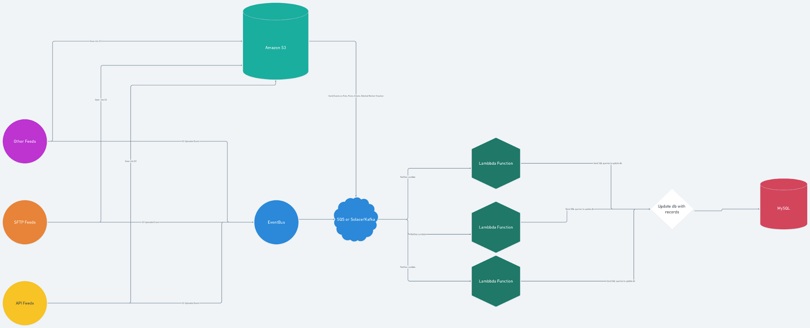

# ETL Database File Synchronziation ADR

## Status

Accepted

## Context

Due to we creating a database to optimize query to retrieve and process data feed files, and the decision to keep these files on S3, then we require a way to keep the ETL database tables up to date with new files from uploaders.

## Decision

The ETL system will listen for events coming from the uploaders on a central queue delivery mechanism which will then update the database records accordingly and ensures all ETL tables are consistently up to date with the files in S3. 

We initially considered using vendor specific events from the filestore but due to the need to not be vendor locked in, we will be creating a topic on our in-house deployed queue service which will deliver these events directly from the uploader service and window specific uploader jars.

